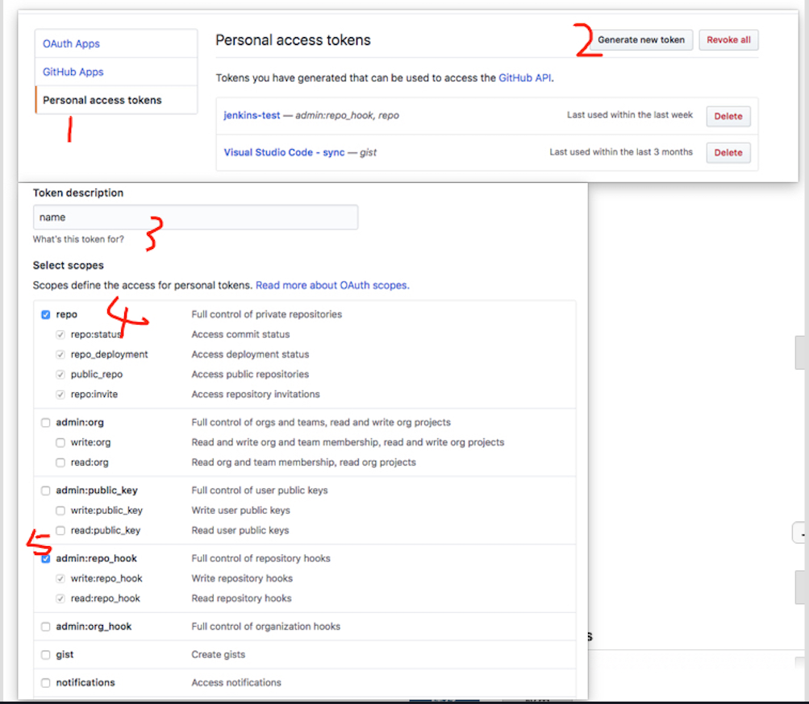
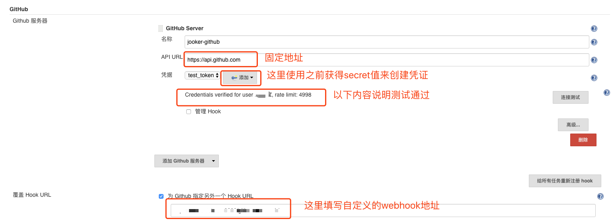
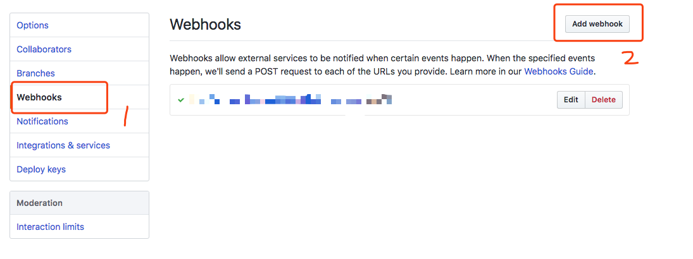
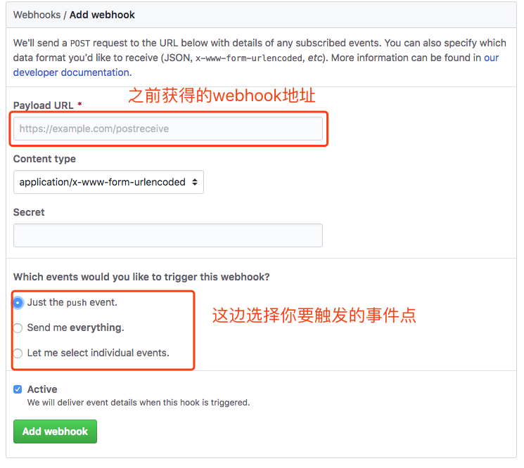
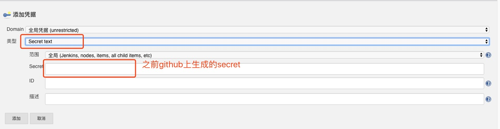
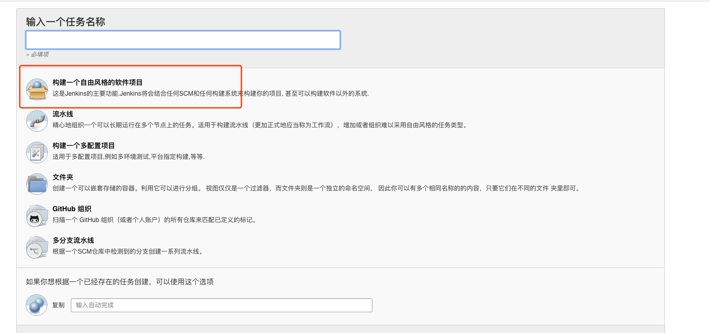
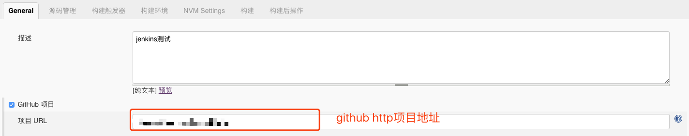
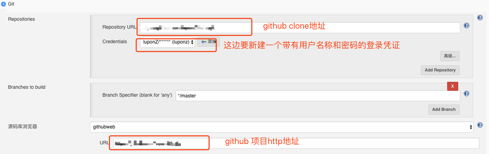
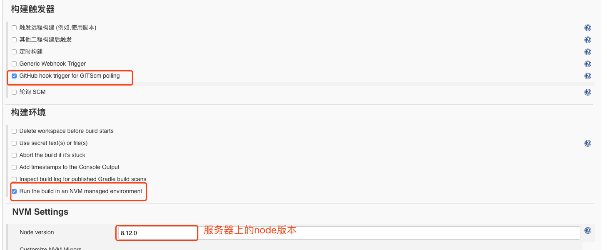
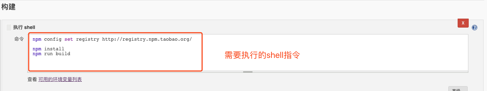

**jenkins需要依赖java环境**
### java ubuntu 安装
```bash
// 安装add-apt-repository 依赖工具
sudo apt-get install python-software-properties

// 添加仓库源环境
sudo add-apt-repository ppa:webupd8team/java

// 更新软件包列表
sudo apt-get update

// 安装javaJDK
sudo apt-get install oracle-java8-installer

// 查看java
sudo update-alternatives --config java

  Selection    Path                                     Priority   Status
------------------------------------------------------------
  0            /usr/lib/jvm/java-8-oracle/jre/bin/java   1081      auto mode
* 1            /usr/lib/jvm/java-8-oracle/jre/bin/java   1081      manual mode

// copy path
// 设置JAVA_HOME环境变量
sudo vi /etc/environment
```
### jenkins环境安装
```bash
wget -q -O - https://pkg.jenkins.io/debian/jenkins.io.key | sudo apt-key add -
sudo sh -c 'echo deb http://pkg.jenkins.io/debian-stable binary/ > /etc/apt/sources.list.d/jenkins.list'
sudo apt-get update
echo y|sudo apt-get install jenkins
// 关闭8080防火墙
sudo ufw allow 8080
```

### 启动和关闭
启动服务：sudo service jenkins start
重启服务: sudo service jenkins restart
关闭服务: sudo service jenkins stop

### 基础项目配置
#### 获取github的secret_token


#### 利用上面的secret_token设置jekins的github服务器


#### 利用上面重写webhook的地址配置git项目的操作钩子



#### 配置secret凭据


#### 新建项目


#### 项目配置



